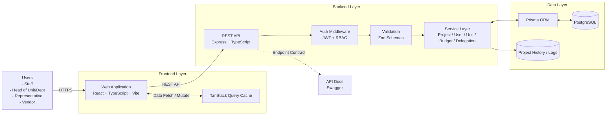
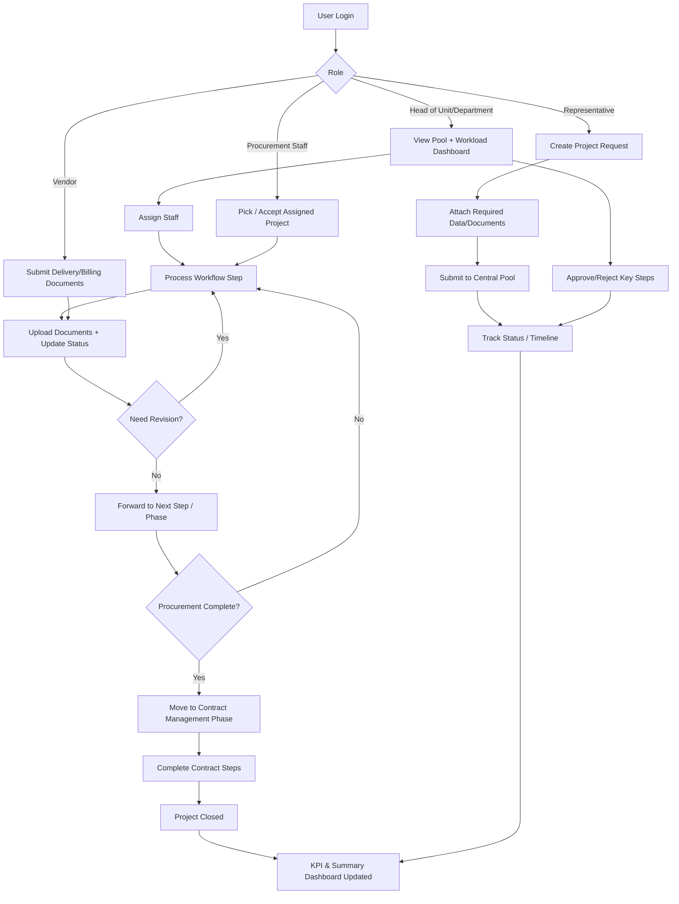
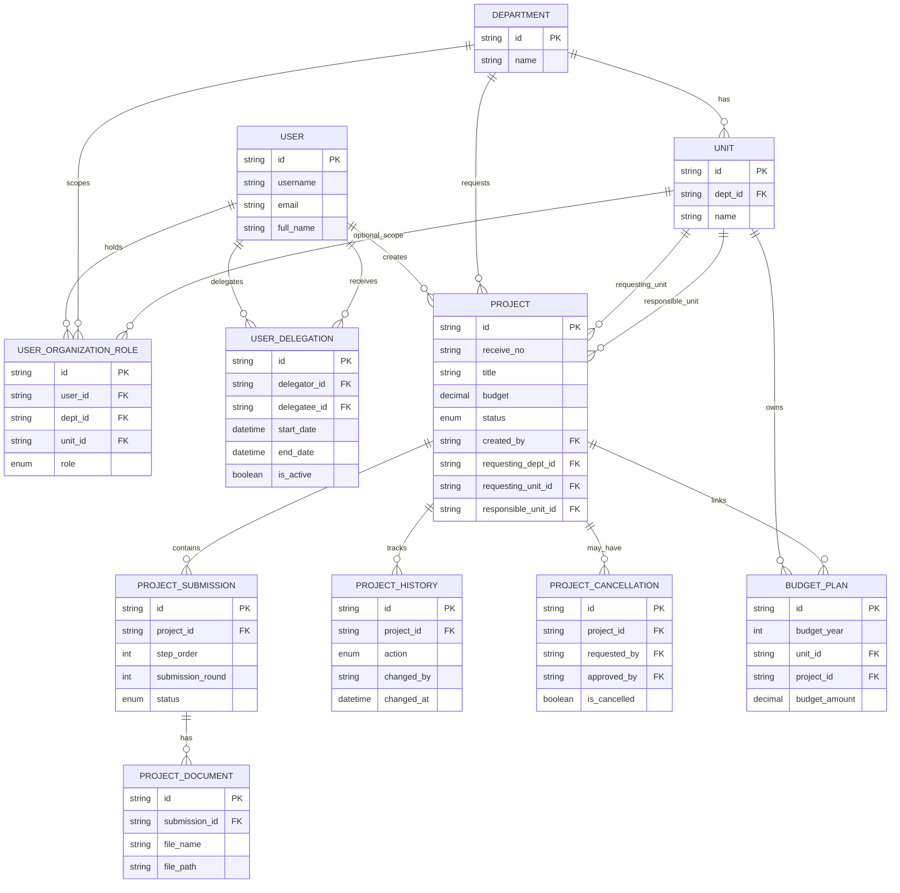

# Introduction & Stakeholder Context (3-5 pages)

## Background & Motivation
จุฬาลงกรณ์มหาวิทยาลัย โดยสำนักบริหารการเงิน การบัญชี และการพัสดุ (สบง.) เป็นหน่วยงานหลักที่มีบทบาทสำคัญในการขับเคลื่อนและสนับสนุนการดำเนินงานของมหาวิทยาลัย ให้เป็นไปอย่างมีประสิทธิภาพ หนึ่งในภารกิจหลักที่สำคัญคืองานด้านพัสดุ โดยมีฝ่ายการพัสดุเป็นผู้รับผิดชอบหลักในการจัดการ และควบคุมกระบวนการจัดซื้อจัดจ้าง รวมทั้งงานการบริหารสัญญา

อย่างไรก็ตาม ปัจจุบันการดำเนินงานของฝ่ายการพัสดุประสบปัญหาที่ส่งผลกระทบต่อประสิทธิภาพและความรวดเร็วในการปฏิบัติงาน ปัญหาหลักประการหนึ่งคือ ความยากลำบากในการติดตามกระบวนการทำงานของเจ้าหน้าที่พัสดุในแต่ละขั้นตอน เนื่องจากยังไม่มีระบบเทคโนโลยีสารสนเทศที่เข้ามาช่วยบริหารจัดการ และติดตามสถานะของโครงการอย่างเป็นรูปธรรม การติดตามความคืบหน้าของงานส่วนใหญ่ยังใช้ระบบเอกสารแบบกระดาษ (Manual) ส่งผลให้เกิดข้อจำกัดในการเข้าถึงข้อมูลแบบตามจริง (Real-Time) ทำให้ผู้บริหารและหัวหน้ากลุ่มงานไม่สามารถทราบถึงรายละเอียดต่าง ๆ ของแต่ละโครงการได้อย่างทันที ซึ่งอาจส่งผลให้เกิดปัญหาปริมาณงานสะสมและงานค้างเป็นจำนวนมาก อีกทั้งการตรวจสอบปริมาณงานที่เสร็จสิ้นแล้วทำได้ยากและล่าช้า นอกจากนี้ปัญหาดังกล่าวยังทวีความรุนแรงขึ้น เมื่อเกิดความคลาดเคลื่อนในการประสานงานระหว่างหน่วยงาน ซึ่งส่งผลให้ฝ่ายการพัสดุไม่สามารถดำเนินการต่อไปได้ ทำให้กระบวนการทั้งหมดต้องหยุดชะงักและเกิดความล่าช้าในภาพรวม

จากปัญหาที่กล่าวมาข้างต้น ฝ่ายการพัสดุ สบง. ร่วมกับสาขาวิชาวิศวกรรมคอมพิวเตอร์และเทคโนโลยีดิจิทัล คณะวิศวกรรมศาสตร์ จุฬาลงกรณ์มหาวิทยาลัย เล็งเห็นถึงความจำเป็นเร่งด่วนในการพัฒนาระบบเทคโนโลยีสารสนเทศเพื่อเข้ามาแก้ไขปัญหาดังกล่าว จึงเกิดเป็นแนวคิดในการพัฒนาเว็บไซต์ “NexusProcure” ขึ้น โดยมุ่งเน้นเป็นระบบส่วนกลางในการบริหารจัดการกระบวนการจัดซื้อจัดจ้างและบริหารสัญญาแบบครบวงจร ช่วยยกระดับการบริหารจัดการงานพัสดุให้มีความทันสมัย โปร่งใส ตรวจสอบได้ และเพิ่มประสิทธิภาพในการให้บริการแก่ทุกภาคส่วนภายในมหาวิทยาลัยได้อย่างยั่งยืน

## Problem Statement
ปัญหาหลักที่โครงการนี้มุ่งแก้ไขคือ ความล่าช้าและความยากลำบากในการติดตามสถานะกระบวนการจัดซื้อจัดจ้างและบริหารสัญญา ของฝ่ายการพัสดุ สบง. ซึ่งปัจจุบันยังคงพึ่งพาระบบกระดาษ ทำให้ผู้บริหาร หัวหน้ากลุ่มงาน และผู้ปฏิบัติงาน ไม่สามารถทราบข้อมูลต่าง ๆ แบบตามจริง ได้ คณะผู้จัดทำพบว่าปัญหาดังกล่าวมีความซับซ้อนและแก้ไขได้ยากด้วยวิธีการแบบเดิม เนื่องจากปัจจัยต่อไปนี้
1. ความคลาดเคลื่อนในการประสานงานระหว่างหลายภาคส่วน ซึ่งบ่อยครั้งเกิดจากความผิดพลาดในการสื่อสาร ทำให้การทำงานของเจ้าหน้าที่ต้องหยุดชะงัก เกิดความล่าช้าในภาพรวม
2.	การเกิดปัญหาคอขวดจากข้อจำกัดจากการทำงานแบบ Manual ที่ส่งผลให้เกิดปริมาณงานค้างสะสม 
3.	ความเข้มงวดของกฎระเบียบภาครัฐ เนื่องจากงานจัดซื้อจัดจ้างจำเป็นต้องดำเนินการภายใต้กฎระเบียบต่าง ๆ จึงต้องออกแบบระบบมาให้มีความรัดกุม โปร่งใส และสามารถตรวจสอบย้อนหลังได้

## Objectives
1.	เพื่อพัฒนาระบบสารสนเทศสำหรับติดตามและบริหารจัดการงานพัสดุ ผ่านการสร้างเว็บไซต์ที่สามารถติดตามสถานะของกระบวนการจัดซื้อจัดจ้างในแต่ละขั้นตอน ทดแทนการติดตามงานด้วยเอกสารแบบเดิม
2.	เพื่อตรวจสอบผู้รับผิดชอบและระยะเวลาในการปฏิบัติงาน ทำให้สามารถระบุตัวเจ้าหน้าที่ผู้รับผิดชอบงานในแต่ละขั้นตอน และบันทึกระยะเวลาที่ใช้ในการดำเนินการ ลดปัญหาคอขวดและปริมาณงานค้างสะสม
3.	เพื่อลดข้อผิดพลาดและเพิ่มประสิทธิภาพในการประสานงานระหว่างส่วนงานต่าง ๆ ในมหาวิทยาลัย ให้มีระบบที่ช่วยตรวจสอบความถูกต้องของเอกสาร ซึ่งจะช่วยลดความล่าช้าในการดำเนินงาน

## Scope & Limitations
โครงงานเรื่อง NexusProcure มีการจำกัดขอบเขตของการพัฒนาเว็บไซต์เอาไว้ 4 ข้อหลัก ดังนี้
1. ระบบยืนยันตัวตนและจัดการผู้ใช้งาน
    1. การจำกัดสิทธิ์ผู้แทนฝ่าย โดยระบบต้องบังคับให้ 1 ฝ่าย มีผู้ใช้งานในบทบาทผู้แทนฝ่าย ได้เพียง 1 คนเท่านั้น เพื่อป้องกันความซ้ำซ้อนในการสร้างโครงการ
    2. การจับคู่ผู้ใช้งานกับฝ่ายและกลุ่มงาน โดยระบบต้องมีหน้าจอสำหรับผู้ดูแลระบบเพื่อเชื่อมโยงบัญชีผู้ใช้เข้ากับฝ่ายและกำหนดบทบาทการทำงาน
    3. การตั้งค่าผู้รักษาการแทนหรือหัวหน้างานใหม่ โดยระบบต้องสามารถระบุผู้รักษาการแทนชั่วคราว เพื่อให้มีสิทธิ์ในการดำเนินงานแทนเจ้าหน้าที่ตัวจริงในช่วงเวลาที่กำหนด หรือมีการเปลี่ยนหัวหน้างาน
    4. การจัดการกลุ่มงานพัสดุ โดยระบบต้องอนุญาตให้ผู้ดูแลระบบสามารถสร้าง แก้ไข หรือลบ กลุ่มงานภายในหน่วยงานพัสดุได้
2. ระบบการรับเรื่องและมอบหมายงาน 
    1. การสร้างโครงการแบบระบุข้อมูลเอง โดยผู้แทนหน่วยงานสามารถสร้างโครงการได้ 2 รูปแบบ คือ สร้างใหม่ หรือเลือกจากแผนโดยระบบต้องแสดงรายการแผนงบประมาณที่นำเข้าไว้แล้ว (จากข้อที่ 2.8) ในรูปแบบ Multi-select checkbox เพื่อให้สามารถเลือกหลายรายการมารวมเป็น 1 โครงการจัดซื้อได้ สามารถเลือกติดแท็กด่วนหรือปกติได้ ถ้าติดแท็กด่วนจะต้องระบุวันที่ต้องการให้งานเสร็จ และระบบจะออกเลขรับ และเก็บเลข reference เก่าไว้ด้วย เช่น เลขรับในระบบคือ 123 reference เลขรับใน less paper คือ 6573 โดยกำหนดให้ 1 โครงการ 1 เลขรับ
    2. การนำเข้าโครงการจำนวนมาก โดยระบบต้องรองรับการนำข้อมูลหลายโครงการเข้าสู่ระบบพร้อมกันผ่านไฟล์ Excel เพื่อลดระยะเวลาการกรอกข้อมูล
    3. ระบบงานกลาง โดยเมื่อโครงการถูกสร้าง ระบบจะส่งงานเข้าสู่ระบบงานกลาง (Pool) ของกลุ่มงานที่เกี่ยวข้องโดยอัตโนมัติในสถานะยังไม่ได้มอบหมาย
    4. การเลือกรับงานด้วยตนเอง โดยเจ้าหน้าที่ในกลุ่มงานสามารถเลือกงานที่ตนเองถนัดหรือตามความเหมาะสมจากคิวงานกลางมาเป็นงานในความรับผิดชอบได้
    5. การมอบหมายงานและยืนยันรับงาน โดยหัวหน้าสามารถมอบหมายงานระบุตัวบุคคลได้ แต่เจ้าหน้าที่ต้องกดยืนยันเพื่อเริ่มการทำงานจริง
    6. การตรวจสอบการกระจายงาน โดยระบบต้องแสดงผลข้อมูลในรูปแบบภาพรวมเพื่อให้หัวหน้างานสามารถตรวจสอบปริมาณงานที่เจ้าหน้าที่แต่ละคนกำลังรับผิดชอบอยู่ เพื่อใช้เป็นข้อมูลประกอบการตัดสินใจมอบหมายงาน หรือเพื่อให้เจ้าหน้าที่ใช้พิจารณาก่อนเลือกรับงานใหม่ เพื่อไม่ให้เกิดภาระงานล้นตัว
    7. รายการงานที่ต้องปฏิบัติ โดยระบบต้องแสดงรายการงานส่วนบุคคลที่ผู้ใช้งานต้องดำเนินการ ได้แก่ งานที่ได้รับมอบหมายใหม่ งานที่ถูกส่งกลับให้แก้ไข และงานเร่งด่วนที่ใกล้ถึงกำหนดชำระหรือครบกำหนดสัญญา
    8. การนำเข้าข้อมูลตั้งต้นแผนงบประมาณ โดยระบบต้องรองรับการนำเข้าข้อมูลแผนงบประมาณประจำปี ของแต่ละหน่วยงานผ่านไฟล์ Excel เพื่อใช้เป็นฐานข้อมูลตั้งต้น โดยข้อมูลชุดนี้จะยังไม่ถูกนับเป็นงานในระบบ จนกว่าจะมีการกดสร้างโครงการจริง
    9. การเปลี่ยนผู้รับผิดชอบของโครงการ โดยระบบจะต้องเปลี่ยนผู้รับผิดชอบของโครงการได้ในกรณีที่ผู้รับผิดชอบคนแรกยังไม่ได้ตอบรับ
    10. การเพิ่มผู้รับผิดชอบของโครงการ โดยระบบจะต้องเพิ่มผู้รับผิดชอบของโครงการได้ โดย 1 โครงการมีได้มากมี่สุด 2 คน ต่อ 1 ช่วงการทำงาน
3. ระบบกระบวนการทำงานจัดซื้อจัดจ้าง 
    1. การกำหนดกระบวนการตามวิธีจัดซื้อและบริหารสัญญา โดยระบบต้องควบคุมขั้นตอนงานตามวิธีจัดซื้อและบริหารสัญญา 
    2. การอัปเดตสถานะและส่งกลับงาน โดยเจ้าหน้าที่สามารถบันทึกความคืบหน้าของงาน และหัวหน้าสามารถสั่งส่งกลับงาน เพื่อให้แก้ไขข้อมูลต่าง ๆ ได้
    3. การจัดการไฟล์และควบคุมเวอร์ชัน โดยระบบต้องรองรับการจัดเก็บเอกสารประกอบโครงการแยกตามขั้นตอน โดยสามารถอัปโหลดไฟล์ได้หลายประเภท และต้องมีระบบจัดเก็บประวัติไฟล์ เพื่อให้สามารถตรวจสอบ ส่งออกบันทึกลำดับเหตุการณ์ (Timeline) และส่งออกเอกสารประกอบโครงการให้ฝ่ายที่เกี่ยวข้อง
    4. ระบบติดตามสถานะโครงการสำหรับหน่วยงานผู้ขอ โดยระบบต้องจัดทำหน้าจอสำหรับเจ้าหน้าที่หน่วยงานอื่น เพื่อใช้ติดตามความคืบหน้าของโครงการที่ตนเองเกี่ยวข้อง
    5. การรวมเอกสารเพื่อการพิจารณา โดยระบบจะรวบรวมไฟล์แนบและข้อมูลสรุปจากทุกขั้นตอนมาแสดงผลในหน้าเดียว เพื่อให้ผู้บริหารตรวจสอบและอนุมัติได้สะดวก
    6. การจัดการเลขที่สัญญา โดยระบบสร้างเลขที่สัญญาตามรูปแบบ เลขที่/ปีงบประมาณ โดยเริ่มนับใหม่ทุกวันที่ 1 ตุลาคม กำหนดให้ 1 โครงการ มี 1 เลขที่สัญญา เจ้าหน้าที่สามารถเลือกปีงบประมาณได้ โดยเลขที่สัญญามีทั้งหมด 5 ชุด แบ่งตาม 4 แผนก และต้องสามารถถูกยกเลิกได้ พร้อมบันทึกเหตุผล
    7. การตรวจสอบและบันทึกรหัสสินทรัพย์ เมื่อสิ้นสุดขั้นตอนการจัดซื้อ และก่อนที่จะเปลี่ยนสถานะเข้าสู่ขั้นตอนการบริหารสัญญา ระบบต้องแสดงหน้าต่างเพื่อสอบถามผู้ใช้งานว่าโครงการนี้มีรหัสสินทรัพย์หรือไม่
    9. การยกเลิกโครงการ สามารถยกเลิกโครงการได้ โดยต้องระบุเหตุผล และส่งให้หัวหน้ากลุ่มงานอนุมัติ
4. ระบบวางบิลสำหรับผู้ขาย 
    1. การส่งเอกสารส่งมอบงาน โดยผู้ขายสามารถอัปโหลดไฟล์หลักฐานการส่งมอบงานผ่านหน้าเว็บได้โดยตรวจสอบผ่านเลข PO

## Stakeholders
1. กลุ่มผู้ใช้งานระบบโดยตรง (End-users)
    1. เจ้าหน้าที่พัสดุและหัวหน้ากลุ่มงาน เป็นกลุ่มผู้ใช้งานหลักที่จะได้ประโยชน์จากการเปลี่ยนผ่านระบบกระดาษสู่ระบบดิจิทัล โดยระบบคิวงานกลาง (Assignment Pool) ที่เข้ามาช่วยขจัดปัญหาความเหลื่อมล้ำของการกระจายงาน ทำให้หัวหน้างานสามารถประเมินและบริหารจัดการทรัพยากรบุคคลได้อย่างมีประสิทธิภาพสูงสุด
    2. ผู้บริหารสำนักพัสดุ ได้รับเครื่องมือสนับสนุนการตัดสินใจในภาพรวม ทำให้สามารถมองเห็นปัญหาคอขวดที่เกิดขึ้น และสามารถนำข้อมูลจากเว็บไซต์ไปใช้ในการวางแผนต่อไป
2. กลุ่มผู้ใช้งานระดับหน่วยงานภายในมหาวิทยาลัย
    1. เจ้าหน้าที่ตัวแทนหน่วยงานผู้ขอซื้อ/จ้าง  โดยระบบจะช่วยลดภาระและความซ้ำซ้อนในการติดตามงาน โดยตัวแทนหน่วยงานสามารถเข้าสู่ระบบเพื่อตรวจสอบสถานะโครงการของตนเองได้แบบตามจริง ช่วยลดความคลาดเคลื่อนในการสื่อสารระหว่างหน่วยงานและเพิ่มความพึงพอใจในการรับบริการจากสำนักพัสดุ
3. กลุ่มผู้มีส่วนได้เสียภายนอก
    1. ผู้ขายและบริษัทคู่ค้า จะได้รับประสบการณ์การประสานงานที่รวดเร็วและเป็นระบบมากขึ้นผ่านระบบบริการสำหรับผู้ขายที่รองรับการอัปโหลดเอกสารส่งมอบงานทางออนไลน์ ซึ่งช่วยลดต้นทุนและระยะเวลาในการเดินทางมาติดต่อด้วยตนเอง

## Expected Benefits
1. ช่วยยกระดับการติดตามสถานะโครงการอย่างเป็นรูปธรรม โดยผู้ใช้งานและผู้บริหารสามารถติดตามสถานะของกระบวนการจัดซื้อจัดจ้างในแต่ละขั้นตอนได้แบบตามจริง ซึ่งเข้ามาทดแทนการใช้ระบบเอกสารแบบกระดาษแบบเดิม
2. ช่วยลดปัญหาคอขวดและปริมาณงานค้างสะสม โดยระบบนี้จะช่วยระบุตัวเจ้าหน้าที่ผู้รับผิดชอบงานและบันทึกระยะเวลาที่ใช้ในการดำเนินการแต่ละขั้นตอนได้อย่างชัดเจน ทำให้สามารถติดตามและจัดการปัญหาความล่าช้าหรือปริมาณงานที่สะสมอยู่ได้อย่างทันท่วงที
3. ช่วยเพิ่มประสิทธิภาพการประสานงานและลดข้อผิดพลาด โดยฝ่ายการพัสดุ สบง. จะมีระบบที่ช่วยตรวจสอบความถูกต้องของเอกสาร ซึ่งช่วยลดปัญหาความคลาดเคลื่อนและการส่งเอกสารไม่ครบถ้วนระหว่างหน่วยงาน ทำให้กระบวนการดำเนินงานลื่นไหลและไม่หยุดชะงัก
4. ช่วยสร้างมาตรฐานใหม่ในการบริหารจัดการงานพัสดุ ของฝ่ายการพัสดุ สบง. ให้มีความทันสมัย โปร่งใส และตรวจสอบได้ โดยทำหน้าที่เป็นเครื่องมือส่วนกลางที่ครอบคลุมการจัดการแบบครบวงจรและเพิ่มประสิทธิภาพการให้บริการอย่างยั่งยืน

# Related Theory and Research (3-5 pages)

## Review of Existing Knowledge
ระบบจัดซื้อจัดจ้างแบบอิเล็กทรอนิกส์ หรือ e-procurement เป็นระบบที่เข้ามาแทนที่ระบบจัดซื้อจัดจ้างแบบเดิม มักถูกใช้ในองค์กรต่าง ๆ รวมถึงสถาบันการศึกษาด้วย ระบบนี้ถูกสร้างขึ้นมาเพื่อเพิ่มประสิทธิภาพ ความโปร่งใส และความสามารถในการตรวจสอบย้อนหลัง [1, 2] ภายในระบบมักจะแบ่งกระบวนการจัดซื้อจัดจ้างออกเป็นขั้นตอนต่าง ๆ ได้แก่ การประเมินในเบื้องต้น โดยปกติแล้ว ระบบที่มีอยู่จะจำแนกวงจรการจัดซื้อจัดจ้างออกเป็นขั้นตอนต่าง ๆ ได้แก่ การตรวจสอบคุณสมบัติเบื้องต้น การประกาศเชิญชวนทั่วไป การยื่นข้อเสนอแนะหรือใบเสนอราคา การประเมินผล และการประกาศผลผู้ชนะการจัดซื้อจัดจ้าง [3] ในปัจจุบันได้มีการนำปัญญาประดิษฐ์ (Artificial Intelligence: AI) เข้ามาใช้กับระบบ e-procurement ด้วย ผ่านการนำ AI เข้ามาช่วยในการตัดสินใจการจัดซื้อจัดจ้างผ่านการใช้วิธีประมวลผลภาษาธรรมชาติ (Natural Language Processing: NLP) กับข้อมูลที่มีอยู่ หรือนำมาช่วยควบคุมดูแลการบริหารสัญญา [4]

องค์ประกอบที่สำคัญของระบบ e-procurement ในปัจจุบันคือรายงานสรุปข้อมูล (Dashboard: แดชบอร์ด) ซึ่งจะนำข้อมูลดิบที่ทำความเข้าใจยาก เปลี่ยนเป็นข้อมูลที่ใช้งานได้ เพื่อสนับสนุนผู้บริหารในการตัดสินใจในเรื่องต่าง ๆ เช่น การบริหารจัดการงบประมาณ หรือการจัดการกับความเสี่ยง [5] อย่างไรก็ตามมีงานวิจัยพบว่าถึงแม้จะมีการศึกษาอย่างถี่ถ้วนแล้วถึงข้อมูลที่จะนำมาใช้งานในแดชบอร์ดนี้ แต่หลายครั้งมักจะพบความยุ่งยากและซับซ้อน เมื่อต้องออกแบบแดชบอร์ดจริง ส่งผลให้ผู้ใช้งานตีความแดชบอร์ดได้ยาก โดยเฉพาะผู้ใช้งานทั่วไป [6] 

ในบริบทของประเทศไทย การจัดซื้อจัดจ้างภาครัฐได้ถูกยกระดับและควบคุมภายใต้พระราชบัญญัติการจัดซื้อจัดจ้างและการบริหารพัสดุภาครัฐ พ.ศ. 2560 โดยมีกรมบัญชีกลางเป็นหน่วยงานหลักในการพัฒนาระบบ e-GP (Electronic Government Procurement) ให้เป็นศูนย์กลางข้อมูลสารสนเทศ เพื่อสร้างความโปร่งใส ป้องกันการทุจริตคอร์รัปชัน และเปิดโอกาสให้ผู้มีส่วนได้ส่วนเสียสามารถตรวจสอบข้อมูลได้ [7] อย่างไรก็ตาม พบว่าแม้จะมีระบบจากส่วนกลางแล้ว แต่ในระดับการปฏิบัติงานภายในองค์กรยังคงพบปัญหาความล่าช้าอย่างมากในขั้นตอนการเตรียมเอกสารก่อนที่จะนำข้อมูลเข้าสู่ระบบ e-GP และยังพบว่ากระบวนการทำงานภายในมหาวิทยาลัยมักเกิดความล่าช้าโดยที่ผู้บริหารไม่สามารถทราบสาเหตุแน่ชัดว่าเกิดจากขั้นตอนใด [8]

## Comparison with Existing Systems
จากการศึกษาระบบ e-procurement ที่มีอยู่ในปัจจุบัน จากงานวิจัยต่าง ๆ ที่ศึกษาเรื่องดังกล่าว คณะผู้จัดทำพบข้อดีและข้อเสียของระบบดังกล่าว โดยจะขอกล่าวในจุดเด่นก่อน คือ ระบบ e-Procurement ช่วยเพิ่มความโปร่งใสและลดโอกาสในการทุจริตได้อย่างเป็นรูปธรรม เนื่องจากระบบมีคุณสมบัติในการตรวจสอบย้อนหลัง ทำให้พบว่าสามารถลดโอกาสที่จะเกิดการประพฤติมิชอบลงได้อย่างเห็นได้ชัด [9] นอกจากนี้ การนำระบบอิเล็กทรอนิกส์มาใช้ยังช่วยเสริมประสิทธิภาพในการดำเนินงานโดยลดระยะเวลาในการรับส่งข้อมูลและงานด้านเอกสาร ส่งผลให้ต้นทุนการดำเนินงานโดยรวมลดลงอย่างมีนัยสำคัญ [10, 11] รวมถึงการสร้างมาตรฐานของข้อมูลให้สอดคล้องกับมาตรฐานสากล เช่น มาตรฐานข้อมูลการจัดซื้อจัดจ้างแบบเปิด (Open Contracting Data Standard) เพื่อส่งเสริมการเปิดเผยข้อมูลการใช้จ่ายงบประมาณสู่สาธารณะ [12] 

นอกจากนี้ในด้านเทคนิค การนำสถาปัตยกรรมซอฟต์แวร์สมัยใหม่ เช่น การออกแบบแบบแยกส่วน (Decoupled) หรือสถาปัตยกรรมไมโครเซอร์วิส (Microservices) มาประยุกต์ใช้ในระบบ e-Procurement จะช่วยเพิ่มความยืดหยุ่นและการรองรับการขยายตัวของระบบ (Scalability) ทำให้การประมวลผลข้อมูลในหน้าแดชบอร์ดมีประสิทธิภาพและก้าวข้ามข้อจำกัดของระบบแบบรวมศูนย์ (Monolithic) ดั้งเดิมได้ [13]

อย่างไรก็ตาม ระบบที่มีอยู่ในปัจจุบันยังคงมีจุดด้อยหลายประการ ประการแรกคือความครอบคลุมของกระบวนการที่จำกัด หลายระบบรองรับเพียงการทำงานบางส่วน เช่น การวางแผนจัดซื้อ โดยมักขาดระบบปฏิบัติงานอัตโนมัติที่ครบวงจร [14] ประการที่สองคือข้อจำกัดเรื่องระบบและทักษะของคน โดยปัญหาที่พบบ่อยคือเซิร์ฟเวอร์รองรับการทำงานไม่ไหว ทำให้การอัปโหลดหรือดาวน์โหลดไฟล์ล่าช้า รวมถึงเจ้าหน้าที่แอดมินหรือผู้ใช้งานบางส่วนยังขาดทักษะด้านเทคโนโลยี [9] รวมถึงการขาดการเชื่อมโยงข้อมูล (Integration) ระหว่างระบบจัดซื้อกับระบบหลังบ้านอื่น ๆ เช่น ระบบตรวจสอบบัญชี กฎหมาย หรือระบบจัดการสัญญา [15] ประการถัดมาคือปัญหาอคติส่วนบุคคล (Human Bias) ซึ่งแม้จะใช้ระบบดิจิทัล แต่สุดท้ายการพิจารณาผู้เข้าประมูลก็ยังต้องพึ่งพาการตัดสินใจของมนุษย์อยู่ดี อาจทำให้เกิดความลำเอียงขึ้นมา ทั้งที่จริง ๆ แล้วระบบถูกออกแบบมาเพื่อลบปัญหานี้ออกไป [3]

นอกจากนี้ งานวิจัยล่าสุดยังชี้ให้เห็นถึงปัญหาด้านความซับซ้อนและประสบการณ์ผู้ใช้งาน (User Experience) โดยพบว่าความไม่พึงพอใจในระบบ e-Procurement มักมีสาเหตุหลักมาจากการขาดการออกแบบที่ใช้งานง่าย ซึ่งส่งผลให้เกิดความต้านทานในการยอมรับเทคโนโลยีใหม่ [16] และประการสุดท้ายคือ การขาดการเชื่อมโยงกระบวนการที่ส่งผลต่อปัญหาคอขวดของภาระงาน หากระบบอิเล็กทรอนิกส์ไม่ได้รับการออกแบบมาให้สอดรับกับกระบวนการทำงานจริง มักจะทำให้เกิดช่องว่างระหว่างขั้นตอน เช่น การสั่งซื้อและการตรวจรับที่ไม่ต่อเนื่องกัน ส่งผลให้ความแปรปรวนของระยะเวลาทำงาน และภาระงานของเจ้าหน้าที่ไม่ได้รับการแก้ไขอย่างยั่งยืน [17]

## Gap Linkage to Project
จากการศึกษาพบว่า ถึงแม้ระบบ e-procurement จะถูกนำไปประยุกต์ใช้งานอย่างแพร่หลาย แต่ก็ยังมีช่องโหว่อีกหลายจุดที่คณะผู้จัดทำคาดว่าโครงงาน NexusProcure จะเข้ามาแก้ช่องโหว่เหล่านี้ ได้แก่
1.	การลดความซับซ้อนของข้อมูลเพื่อสนับสนุนการตัดสินใจของผู้บริหาร งานวิจัยพบว่าถึงแม้จะมีการนำแดชบอร์ดมาใช้ แต่ในระบบจริงมักพบความยุ่งยากและซับซ้อน ทำให้ผู้ใช้งานและผู้บริหารตีความข้อมูลได้ยาก โครงงานนี้จึงแก้ไขช่องโหว่ดังกล่าวโดยการพัฒนาระบบรวบรวมไฟล์แนบและข้อมูลสรุปจากทุกขั้นตอนมาแสดงผลในหน้าเดียว เพื่อให้ผู้บริหารตรวจสอบและอนุมัติได้สะดวก รวมถึงมีการแสดงแดชบอร์ดภาพรวมที่สรุประยะเวลาการทำงาน รวมถึงรายละเอียดต่าง ๆ ไว้อย่างชัดเจน
2.	การบริหารจัดการวงจรแบบครบวงจรและการเชื่อมโยงข้อมูล ระบบ e-Procurement ในปัจจุบันยังมีข้อจำกัดเรื่องความครอบคลุมของกระบวนการการทำงาน และขาดการเชื่อมต่อกับระบบหลังบ้านอื่น ๆ เช่น ระบบจัดการสัญญา โครงงานนี้จึงออกแบบให้เป็นระบบส่วนกลางที่เชื่อมโยงตั้งแต่การออกเลขรับโครงการ การสร้างและจัดการเลขที่สัญญา ไปจนถึงการมีระบบวางบิลสำหรับผู้ขายเพื่ออัปโหลดหลักฐานการส่งมอบงาน
3.	การติดตามสถานะแบบตามจริงเพื่อลดความล่าช้าแฝง กระบวนการทำงานภายในมหาวิทยาลัยมักเกิดความล่าช้าโดยที่ผู้บริหารไม่สามารถทราบสาเหตุแน่ชัดว่าเกิดจากขั้นตอนใด โครงงานนี้จึงได้นำระบบคิวงานกลาง (Pool) เข้ามาใช้จัดการคิวงาน พร้อมทั้งมีระบบจัดเก็บประวัติไฟล์ที่สามารถบันทึกลำดับเหตุการณ์ (Timeline) ทำให้หน่วยงานผู้ขอและผู้บริหารสามารถติดตามสถานะการจัดซื้อจัดจ้างได้แบบ real-time

# System Design (5-8 pages)

## System Architecture
ระบบ NexusProcure ได้รับการออกแบบให้ใช้สถาปัตยกรรมแบบแยกส่วน (Decoupled Architecture) หรือ Client-Server Model เพื่อให้การพัฒนา การทดสอบ และการดูแลรักษาระบบเป็นไปอย่างมีประสิทธิภาพและสามารถขยายขนาด (Scalability) ได้ในอนาคต สถาปัตยกรรมหลักประกอบด้วย 3 ส่วนสำคัญ ได้แก่

1. Presentation Layer (Frontend) ทำหน้าที่แสดงผลและรับคำสั่งจากผู้ใช้งาน โดยมีการจัดการสถานะของข้อมูล (State Management) ออกเป็น 2 ส่วน คือ ข้อมูลจากเซิร์ฟเวอร์ (Server State) และข้อมูลสถานะของหน้าจอ (Client/UI State) เพื่อลดภาระการประมวลผลและลดการดึงข้อมูลที่ซ้ำซ้อน
2. Application Layer (Backend) ทำหน้าที่ประมวลผลตรรกะหลังบ้าน (Business Logic) ตรวจสอบสิทธิ์การเข้าถึงแบบ Role-based Access Control (RBAC) และเป็นตัวกลางในการสื่อสารกับฐานข้อมูลผ่าน RESTful API
3. Data Layer (Database) ทำหน้าที่จัดเก็บข้อมูลทั้งหมดของระบบในรูปแบบฐานข้อมูลเชิงสัมพันธ์ (Relational Database)

โดยมีลักษณะการไหลของข้อมูล (Data Flow) ดังนี้
1. ผู้ใช้งาน (เจ้าหน้าที่พัสดุ/หัวหน้า/ผู้แทนหน่วยงาน/ผู้ขาย) เข้าใช้งานผ่านเว็บแอปพลิเคชัน
2. Frontend ส่งคำขอผ่าน REST API ไปยัง Backend
3. Backend ตรวจสอบสิทธิ์ด้วย JWT และบทบาทผู้ใช้งาน (Role-based Access Control)
4. บริการในระบบ (Service Layer) ประมวลผลตาม workflow ของโครงการจัดซื้อจัดจ้าง
5. บันทึก/อ่านข้อมูลจาก PostgreSQL ผ่าน Prisma ORM
6. ส่งผลลัพธ์กลับไปแสดงผลเป็นตาราง และไทม์ไลน์

เพื่อรองรับงานจัดซื้อจัดจ้างที่มีหลายขั้นตอน ระบบกำหนดสถานะโครงการแบบแยกช่วงการดำเนินงานเป็นช่วงจัดซื้อและช่วงบริหารสัญญา พร้อมลำดับขั้นงานตามประเภทการจัดซื้อ และมีการบันทึกประวัติการเปลี่ยนแปลง (History/Log) เพื่อการตรวจสอบย้อนหลัง

ต่อไปนี้จะเป็นการแสดงภาพของแผนภาพสถาปัตยกรรมระบบ (System Architecture Diagram) ในภาพที่ 3.1 และแผนภาพการใช้งานของผู้ใช้ (User Flow) ในภาพที่ 3.2

### Figure 3.1 System Architecture Diagram

### Figure 3.2 User Flow Diagram (Procurement Workflow)

## Components
องค์ประกอบหลักของระบบแบ่งออกเป็น 5 ส่วนดังแสดงในภาพที่ … ประกอบด้วย

1. ส่วนติดต่อผู้ใช้งาน (Frontend) พัฒนาด้วย React (Vite) และ TypeScript โดยมีการจัดโครงสร้างแบบ Feature-Based Architecture เพื่อแยกองค์ประกอบหลังบ้าน (Domain-focused modules) ออกจากกันอย่างชัดเจน มีการใช้ Tailwind CSS ร่วมกับ shadcn/ui ในการออกแบบส่วนติดต่อผู้ใช้งาน นอกจากนี้ยังใช้ TanStack Query ในการจัดการข้อมูลฝั่งไคลเอนต์ (Server State) และใช้ TanStack Table สำหรับการจัดการแสดงผลตารางข้อมูลที่ซับซ้อน

2. ส่วนประมวลผล (Backend) พัฒนาด้วย Node.js ภายใต้เฟรมเวิร์ก Express เวอร์ชัน 5 มีการควบคุมความถูกต้องของข้อมูล (Validation) ทั้งฝั่งรับและส่งผ่านไลบรารี Zod และจัดการการรับรองตัวตน (Authentication) ผ่าน JWT (JSON Web Token) ร่วมกับระบบ In-memory Cache แบบ LRU (Least Recently Used)

3. ระบบฐานข้อมูล (Database) ใช้ PostgreSQL ผ่านระบบบริการฐานข้อมูลแบบไม่สนใจเซิร์ฟเวอร์ (Serverless Database) ของ Neon โดยมี Prisma (เวอร์ชัน 7) เป็น ORM ในการจัดการโครงสร้าง (Schema) และเรียกใช้ข้อมูลต่าง ๆ โดยมีการออกแบบระบบฐานข้อมูล ตามแผนภาพข้อมูลเชิงสัมพันธ์เอ็นทิตี (Entity Relationship Diagram: ER Diagram) ดังแสดงในภาพที่ 3.3

### Figure 3.3 ER Diagram (Core Database Model)

## Design Considerations
เพื่อให้ระบบสามารถรองรับการใช้งานจริงของฝ่ายการพัสดุ ได้อย่างมีประสิทธิภาพ คณะผู้จัดทำได้คำนึงถึงปัจจัยสำคัญในการออกแบบ ดังนี้

1. ด้านประสิทธิภาพ (Performance & Scalability) โดยการลดภาระการประมวลผลที่ไม่จำเป็นด้วยการแบ่งหน้าข้อมูล (pagination) การกำหนด filter/query ชัดเจน และการ cache ข้อมูลฝั่ง backend บางส่วน เช่น ข้อมูลสิทธิ์ผู้ใช้ เพื่อให้รองรับข้อมูลโครงการจำนวนมาก

2. ด้านการขยายขนาดของเว็บไซต์ (Scalability) ผ่านการแยก frontend และ backend ออกจากกัน ทำให้สามารถขยายแต่ละส่วนได้อิสระ และแยก service ตามโดเมนงาน คือ project, user, unit, budget-plan และ delegation เพื่อรองรับการเติบโตของฟีเจอร์

3. ด้านการใช้งาน (Usability) ออกแบบ workflow ให้สอดคล้องกับการทำงานจริงของฝ่ายพัสดุ เช่น ระบบคิวงานกลาง การเลือกรับงานเอง การส่งงานกลับ และหน้าติดตามสถานะแบบ real-time สำหรับหน่วยงานผู้ขอ เพื่อลดการประสานงานผ่านเอกสาร

4. ด้านการติดตามและธรรมาภิบาล (Traceability & Governance) โดยระบบได้รับการออกแบบมาให้ทุกขั้นตอนสำคัญของโครงการถูกจัดเก็บสถานะและประวัติการแก้ไข ทำให้สามารถตรวจสอบย้อนหลังได้ รองรับข้อกำกับด้านความโปร่งใสและธรรมาภิบาลของงานจัดซื้อจัดจ้างภาครัฐ

5. ด้านความสมบูรณ์ของข้อมูลและความเชื่อมั่นในระบบ (Data Integrity & Reliability) ผ่านการกำหนด validation schema (Zod) และข้อบังคับของข้อมูลในระดับฐานข้อมูล (Prisma schema) เพื่อลดข้อผิดพลาดจากข้อมูลไม่ครบถ้วนหรือรูปแบบไม่ถูกต้อง

6. ด้านความยั่งยืนและการดูแลระบบ (Sustainability & Maintainability) โดยเลือกใช้เทคโนโลยีมาตรฐานที่มีชุมชนผู้พัฒนาสนับสนุนสูง เช่น React, Express, PostgreSQL และออกแบบโครงสร้างโค้ดแบบ feature/service-driven เพื่อให้รุ่นถัดไปดูแลต่อได้ง่าย

## Proposed vs. Final Design
ในส่วนนี้จะเป็นการเปรียบเทียบระหว่างข้อเสนอ กับระบบสุดท้ายที่ได้ออกแบบ ดังแสดงในตารางที่ … โดยมีประเด็นที่เหมาะสมกับพิจารณาด้วยกันหลายประเด็น ดังนี้

| ประเด็น | Proposed  | สิ่งที่ทำได้จริงในโค้ด (Implemented) |
| --- | --- | --- |
| Identity & Access | เน้น CU Net (LDAP), 1 representative ต่อหน่วยงาน | มี `auth/register`, `auth/login`, JWT + RBAC + delegation + ข้อจำกัด representative ผ่าน route/service แต่ **ยังไม่พบ LDAP integration โดยตรง** |
| Job Intake & Assignment | สร้างงาน + pool + self-picking + manual assign  | มี `/projects/create`, `/projects/import`, `/projects/unassigned`, `/projects/assign`, `/projects/accept`, `/:id/claim`, `/:id/change-assignee`, `/:id/add-assignee` |
| Workflow Control | แยก flow เฉพาะเจาะจง / e-bidding + executive summary  | มี `submissions` lifecycle ชัดเจน (`approve`, `propose`, `sign`, `reject`) และมี phase transition (`complete-procurement`, `complete-contract`, `close`) |
| Cancellation / Rework | มีแนวคิด return flow  | มี `/projects/:id/cancel`, `/approve-cancel`, `/reject-cancel`, และ `/request-edit` |
| Dashboard & Workload | เน้น dashboard รวมและ KPI  | มี endpoint รองรับ summary/workload (`/projects/summary`, `/projects/workload`) และหน้า list/query สำหรับติดตามงาน |
| Notification & Vendor Portal | มีแนวคิดแจ้งเตือน/วางบิลผู้ขาย  | ใน backend ปัจจุบัน **ยังไม่พบโมดูล notification/email หรือ public vendor endpoint** (ทุก route หลักถูก protect) จึงถือเป็นงานต่อยอด |

จากการเปรียบเทียบจะเห็นว่า Final Design ขยายขอบเขตจากเอกสารเสนอเดิมอย่างชัดเจน และระบบที่พัฒนาแล้วครอบคลุมแกนหลักด้านการรับเรื่อง-มอบหมาย-ติดตาม workflow ได้ครบในระดับ MVP ขณะที่งานเชื่อมต่อภายนอก (เช่น LDAP/SMTP/Vendor public flow) ยังเป็นส่วนที่ต้องพัฒนาต่อในระยะถัดไป

# Implementation (5-8 pages)

## Development process
Modules, algorithms, prototypes built

## Tools, frameworks, or environments
Programming languages, libraries, development platforms, testing environments

## Challenges encountered and resolutions
Technical, design, or integration difficulties and how the team overcame them

## Evidence of functional prototype/system
Screenshots, architecture logs, photos, demo references

# Testing and Experimentation (3-5 pages)

## Experiment/Test Plan
What was tested and why

## Setup
Hardware/software environment, datasets, conditions

## Metrics
Accuracy, efficiency, usability, sustainability, etc.

## Test Cases
Key scenarios for validation

# Results and Analysis (3-5 pages)

## Results presentation
Summarize findings clearly with tables, charts, and graphs.

Evaluate outcomes against stated objectives, benchmarks, or standards.

## Analysis & interpretation
Explain patterns, significance, and implications of results.

## Limitations & lessons
Discuss unexpected issues, anomalies, and what was learned.

# Project Management and Teamwork (1 pages)

## Timeline & milestones
Show progress made and key deliverables completed.

## Work division
การจัดสรรงานภายในทีมเป็นไปตามความสามารถและความถนัดของแต่ละบุคคล ดังนี้
- ... รับผิดชอบงานส่วน UX Designer, Project Manager และ Tester
- ... รับผิดชอบงานส่วน Business Analyst และ Front-end Developer
- ... รับผิดชอบงานส่วน Full-stack Developer (เน้นการพัฒนา Back-end)
- ... รับผิดชอบงานส่วน Full-stack Developer (เน้นการพัฒนา Front-end)

## Communication
ภายในทีมใช้ Notion ในการจัดการงานเอกสารต่าง ๆ รวมทั้งการติดตามงาน (Sprint Tracker) ร่วมกับ Discord ในการพูดคุย ระดมความคิด และปรึกษาปัญหาร่วมกัน และจัดให้มีการประชุมติดตามงาน (Sprint Recap) หลังจบแต่ละ Sprint นอกจากนั้นมีการใช้ Line สำหรับการพูดคุยกับฝ่ายการพัสดุ เพื่อรายงานความคืบหน้าของโครงงาน ร่วมกับการประชุมแบบเผชิญหน้า ณ ห้องประชุมอาคารจามจุรี 5 และใช้เพื่อพูดคุย ปรึกษาปัญหา และรายงานความคืบหน้าของโครงงานให้อาจารย์ที่ปรึกษารับทราบ

## Reflection
จุดแข็งหลักของทีมคือประสิทธิภาพในการสื่อสารเพื่อรวบรวมความต้องการจากผู้ใช้งานและการออกแบบหน้าจอเบื้องต้น (Prototype) ซึ่งช่วยให้ผู้ใช้งานสามารถเห็นภาพรวมของระบบก่อนเริ่มการพัฒนา ส่งผลให้การทำงานร่วมกันภายในทีมดำเนินไปอย่างราบรื่น อย่างไรก็ตาม ข้อบกพร่องในช่วงเริ่มต้นคือ การขาดเอกสารเกณฑ์การยอมรับ (Acceptance Criteria) สำหรับใช้สื่อสารภายในทีม ทำให้การพัฒนาฟังก์ชันบางส่วนไม่ครอบคลุมตามความต้องการ ทีมจึงได้ปรับปรุงกระบวนการทำงานโดยมอบหมายให้ Business Analyst จัดทำเอกสารดังกล่าว เพื่อเป็นมาตรฐานในการเชื่อมโยงความเข้าใจระหว่างเอกสารความต้องการและกระบวนการพัฒนาระบบจริงให้มีความถูกต้องตรงกัน

# Ethics, Privacy, and Professional Considerations (1 pages)

## Ethical issues
คณะผู้จัดทำให้ความสำคัญกับความเป็นส่วนตัว และความเป็นธรรม (Fairness) ในการปฏิบัติงานเป็นอย่างมาก ในด้านความเป็นส่วนตัว ระบบมีการจัดการสิทธิ์การเข้าถึงข้อมูลที่รัดกุมผ่านระบบยืนยันตัวตน CU Net (LDAP) เพื่อให้มั่นใจว่าข้อมูลการจัดซื้อจัดจ้างและข้อมูลของร้านค้าผู้เสนอราคาจะถูกเข้าถึงได้เฉพาะผู้ที่มีอำนาจหน้าที่เกี่ยวข้องเท่านั้น ในส่วนของความเป็นธรรม มีระบบคิวงานกลางที่ถูกออกแบบมาเพื่อกระจายภาระงานให้แก่เจ้าหน้าที่พัสดุอย่างสมดุล ป้องกันการเลือกปฏิบัติและลดปัญหาความเหลื่อมล้ำของปริมาณงาน นอกจากนี้ยังมี Personal KPI Dashboard ที่ช่วยให้การประเมินผลเป็นไปอย่างโปร่งใสและปราศจากอคติส่วนบุคคล

## Standards & laws
เนื่องจากระบบนี้เกี่ยวข้องกับข้อมูลส่วนบุคคลต่าง ๆ โดยตรง ทำให้ต้องดำเนินงานการจัดเก็บและประมวลผลข้อมูลให้สอดคล้องกับพระราชบัญญัติคุ้มครองข้อมูลส่วนบุคคล พ.ศ. 2562 อีกทั้งต้องออกแบบกระบวนการทำงานภายในระบบให้สอดคล้องกับพระราชบัญญัติการจัดซื้อจัดจ้างและการบริหารพัสดุภาครัฐ พ.ศ. 2560 เพื่อเสริมสร้างความโปร่งใสตามมาตรฐานการดำเนินงานของหน่วยงานภาครัฐ

## Environmental impact
ระบบดังกล่าวจะมีส่วนช่วยอย่างมากในการสร้างความยั่งยืนด้านสิ่งแวดล้อม โดยการเปลี่ยนผ่านกระบวนทำงานแบบ Manual ไปสู่รูปแบบดิจิทัล ช่วยลดการใช้ทรัพยากรกระดาษ ลดปริมาณขยะ และลดการปล่อยก๊าซเรือนกระจกที่เกิดจากการเดินทางเพื่อจัดส่งเอกสารทางกายภาพระหว่างหน่วยงานภายในมหาวิทยาลัยได้อย่างมีนัยสำคัญ

## Intellectual property
สิทธิในทรัพย์สินทางปัญญาของต้นฉบับ (Source Code) ฐานข้อมูล และองค์ประกอบต่างๆ ของระบบ NexusProcure ถือเป็นกรรมสิทธิ์ร่วมกันระหว่างคณะผู้จัดทำ ภาควิชาวิศวกรรมคอมพิวเตอร์ และสำนักบริหารการเงิน การบัญชี และการพัสดุ (สบง.) จุฬาลงกรณ์มหาวิทยาลัย ในฐานะเจ้าของโครงการ ในส่วนของการนำเทคโนโลยีและเครื่องมือแบบเปิด (Open-source Tools) หรือไลบรารีของบุคคลที่สาม (Third-party libraries) มาใช้งาน คณะผู้จัดทำได้ปฏิบัติตามเงื่อนไขของสัญญาอนุญาต (License Agreements) ที่เกี่ยวข้องอย่างเคร่งครัด เพื่อป้องกันการละเมิดลิขสิทธิ์

# Risk and Resource Management (1 pages)

## Risks
ในการพัฒนาระบบ NexusProcure คณะผู้จัดทำได้ประเมินความเสี่ยงหลักที่อาจส่งผลกระทบและกำหนดแนวทางป้องกันไว้ ได้แก่ 1) ความเสี่ยงด้านการเชื่อมต่อระบบ (Integration Risk) เนื่องจากระบบจำเป็นต้องเชื่อมต่อกับ API ของ CU Net หากเกิดปัญหาเกี่ยวกับ API อาจทำให้การพัฒนาหยุดชะงัก เพื่อแก้ไขความเสี่ยงดังกล่าว คณะผู้จัดทำได้เตรียมระบบจำลอง สำหรับการทดสอบในระหว่างการพัฒนา และ 2) ความเสี่ยงด้านการยอมรับของผู้ใช้งาน (User Adoption Risk) เนื่องจากเจ้าหน้าที่พัสดุมีความคุ้นเคยกับระบบเก่า อาจทำให้ไม่อยากเปลี่ยนไปใช้ระบบดิจิทัล เพื่อแก้ไขความเสี่ยงดังกล่าว คณะผู้จัดทำจึงเน้นการออกแบบหน้าจอระบบ ให้มีความเรียบง่าย และคล้ายคลึงกับกระบวนการเดิม

## Adaptations
ในระหว่างการดำเนินงาน คณะผู้จัดทำพบอุปสรรคด้านความคลาดเคลื่อนในการทำความเข้าใจความต้องการของระบบระหว่างผู้พัฒนาและผู้ใช้งาน จึงได้มีการปรับเปลี่ยนกระบวนการทำงาน โดยมอบหมายให้ Business Analyst จัดทำเอกสาร Acceptance Criteria [เพิ่มเติมหลังจากบท 4 และบท 5 เสร็จ]

## Resources
การพัฒนาโครงงานนี้อาศัยทรัพยากรต่าง ๆ ดังนี้ 1) ด้านซอฟต์แวร์ โดยพัฒนาส่วน Frontend ด้วย React (Vite), TypeScript, Tailwind CSS และ shadcn/ui ส่วน Backend ใช้ Node.js (Express) ร่วมกับ Prisma ORM และฐานข้อมูล PostgreSQL 2) ด้านโครงสร้างพื้นฐาน (Infrastructure) โดยใช้คอมพิวเตอร์ส่วนบุคคลของทีมงานสำหรับการพัฒนาเบื้องต้น และ 3) ด้านข้อมูลทดสอบ คณะผู้จัดทำใช้ข้อมูลจำลอง และไฟล์ Excel แผนงบประมาณจำลอง เพื่อทดสอบหลักการทำงานและฟังก์ชันการนำเข้าข้อมูลแบบกลุ่ม

## Cost Considerations
โครงงานนี้มีการบริหารจัดการงบประมาณอย่างรัดกุม โดยเน้นการใช้ประโยชน์จากเทคโนโลยีแบบเปิด (Open-source) ทำให้มีต้นทุนในด้านซอฟต์แวร์การพัฒนาที่ต่ำมาก ค่าใช้จ่ายหลักที่เกิดขึ้นจึงจำกัดอยู่เพียงค่าจดทะเบียนชื่อโดเมน (Domain Name) สำหรับการเข้าถึงเว็บไซต์ ซึ่งคาดการณ์ว่าค่าใช้จ่ายรวมตลอดระยะเวลาจะอยู่ในเกณฑ์ที่ต่ำและไม่เกินขอบเขตงบประมาณที่กำหนด

# Conclusion and Future Work (1-2 pages)

## Achievements
Summarize main results, system features, and contributions.

## Objectives met
Evaluate how well the project goals were fulfilled.

## Applications
Point out technical, industrial, or societal uses.

## Future work
Suggest next steps, enhancements, or research directions.

# Reference
- [1]	I. T. Charnor and E. K. Quartey, "Electronic procurement adoption and procurement performance: does institutional quality matter?," Business Process Management Journal, vol. 30, no. 6, 2024/10/29, doi: 10.1108/BPMJ-02-2024-0106.
- [2]	S. Khorana, S. Caram, and N. P. Rana, "Measuring public procurement transparency with an index: Exploring the role of e-GP systems and institutions," Government Information Quarterly, vol. 41, no. 3, 2024/09/01, doi: 10.1016/j.giq.2024.101952.
- [3]	A. P. C. Chan, E. K. Owusu, A. P. C. Chan, and E. K. Owusu, "Evolution of Electronic Procurement: Contemporary Review of Adoption and Implementation Strategies," Buildings 2022, Vol. 12, Page 198, vol. 12, no. 2, 2022–02–09, doi: 10.3390/buildings12020198.
- [4]	L. Siciliani, V. Taccardi, P. Basile, M. D. Ciano, and P. Lops, "AI-based decision support system for public procurement," Information Systems, vol. 119, 2023/10/01, doi: 10.1016/j.is.2023.102284.
- [5]	J. Doe, "Enhancing Procurement Efficiency through Data-Driven Dashboards: Functionality, Insights, and Strategic Impact," International Journal of Emerging Research in Engineering and Technology, vol. 2, no. 3, 2021/08/20, doi: 10.63282/3050-922X.IJERET-V2I3P101.
- [6]	T. Cerabona, "Study of the application of a decision support approach based on classical physics principles for managing supply chain risks and opportunities within its immersive performance management cockpit," 2023. [Online]. Available: https://theses.fr/2023EMAC0010/document
- [7]	"พระราชบัญญัติการจัดซื้อจัดจ้างและการบริหารพัสดุภาครัฐ พ.ศ. 2560," ed. Thailand, 2017.
- [8]	ภ. แก้วอำภา and ห. เกตุมณีชัยรัตน์, "ปัจจัยที่มีผลต่อการยอมรับระบบการจัดซื้อจัดจ้างด้วยอิเล็กทรอนิกส์ (e-GP) ของเจ้าหน้าที่พัสดุในมหาวิทยาลัย," วารสารวิจัยราชภัฏกรุงเก่า สาขามนุษยศาสตร์และสังคมศาสตร์, vol. 7, no. 2, pp. 9–16, 08/31 2020. [Online]. Available: https://so01.tci-thaijo.org/index.php/rdi-aru/article/view/243384.
- [9]	A. Hamsyah, "Bureaucratic Reform Based on E-Procurement: Opportunities and Challenges," KnE Social Sciences, 2023–10–02, doi: 10.18502/kss.v8i17.14101.
- [10]	N. Pochynok, V. Muravskyi, and V. Farion, "Implementation of electronic communications in accounting of public procurement," Technology audit and production reserves, vol. 4, no. 4(60), 2021/07/31, doi: 10.15587/2706-5448.2021.238858.
- [11]	A. D. Wako, E. B. Oteki, and I. O. Abillah, "Electronic Ordering and its Effect on Tendering Process Efficiency in Public Universities in Kenya," East African Journal of Business and Economics, vol. 7, no. 1, 2024/07/23, doi: 10.37284/eajbe.7.1.2053.
- [12]	S. Mishra, M. Shinde, A. Yadav, B. Ayyub, and A. Rao, "An AI-Driven Data Mesh Architecture Enhancing Decision-Making in Infrastructure Construction and Public Procurement," 2024/11/29, doi: 10.48550/arXiv.2412.00224.
- [13]	G. C. Puspita, H. T. Karsanti, A. Sartono, A. Firman, and D. Arfiani, "Proposing a Microservices Architecture for AMEL Information System Designed Using TOGAF-ADM," in 2023 International Conference on Computer, Control, Informatics and its Applications (IC3INA), 2023, pp. 72–77, doi: 10.1109/IC3INA60834.2023.10285743. [Online]. Available: https://ieeexplore.ieee.org/document/10285743
- [14]	M. Guida, F. Caniato, A. Moretto, and S. Ronchi, "The role of artificial intelligence in the procurement process: State of the art and research agenda," Journal of Purchasing and Supply Management, vol. 29, no. 2, 2023/03/01, doi: 10.1016/j.pursup.2023.100823.
- [15]	G. Myovela, H. Ng’elenge, and B. Kisawike, "Factors Affecting the Adoption of Electronic Procurement in the Public Sector: The Case of Songwe District Council," East African Journal of Business and Economics, vol. 6, no. 2, 2023/11/01, doi: 10.37284/eajbe.6.2.1547.
- [16]	K. Ragin-Skorecka and Ł. Hadaś, "Sustainable E-Procurement: Key Factors Influencing User Satisfaction and Dissatisfaction," Sustainability, vol. 16, no. 13, p. 5649, 2024. [Online]. Available: https://www.mdpi.com/2071-1050/16/13/5649.
- [17]	P. Trkman and K. McCormack, "Estimating the Benefits and Risks of Implementing E-Procurement," IEEE Transactions on Engineering Management, vol. 57, no. 2, pp. 338–349, 2010, doi: 10.1109/TEM.2009.2033046.
